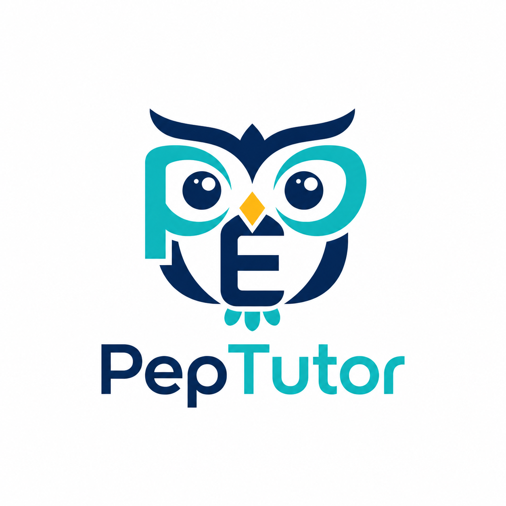
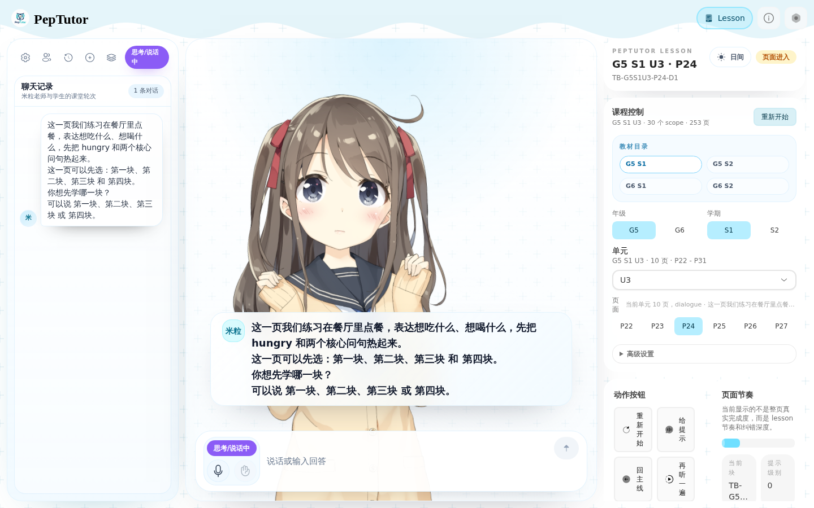
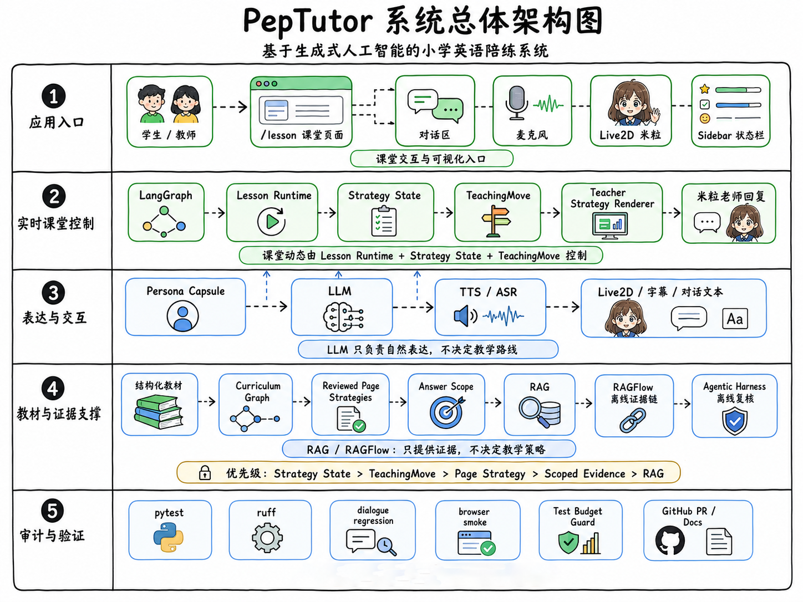
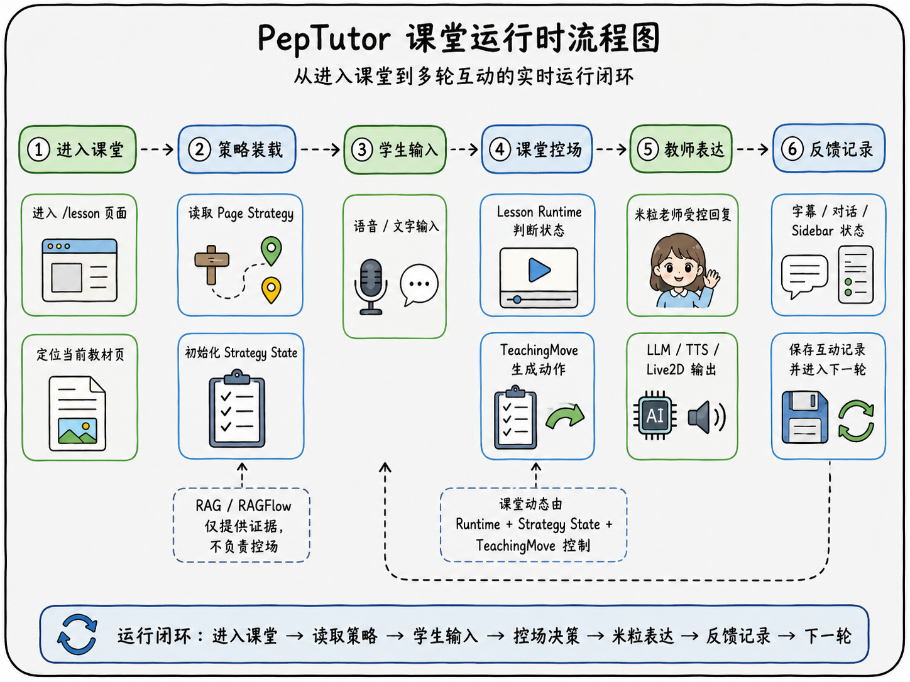
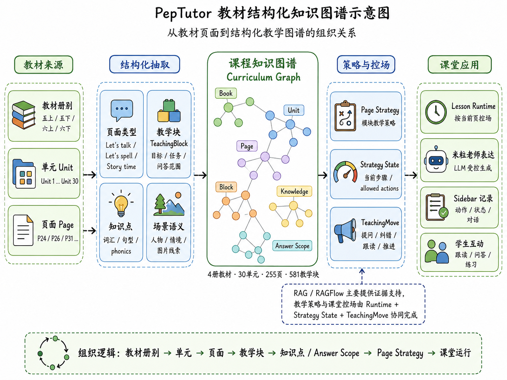

# PepTutor Mili English Tutoring Classroom

<p align="center">
  
</p>

<p align="center">
  <strong>Generative-AI English tutoring classroom for primary-school textbooks</strong><br />
  Bounded teaching actions · Live2D Mili teacher · structured curriculum · offline evidence chain
</p>

<p align="center">
  <a href="README.md">中文 README</a>
</p>

PepTutor is an auditable AI English tutoring classroom for primary-school
textbook practice. It combines structured curriculum data, a lesson runtime,
TeachingMove contracts, a Live2D classroom frontend, speech input/output, and
offline evidence tools. Its purpose is to reduce the common failure modes of
plain LLM tutoring: drifting away from the textbook, repeating the same repair,
and choosing the wrong teaching step.

The live classroom control path remains bounded and reviewable. RAGFlow,
agentic retrieval, and similar external tools are offline evidence sources only.
They do not control classroom route, block progression, TeachingMove decisions,
or student-visible replies.

GitHub repository:

```text
https://github.com/rootliuat/PepTutor
```

## Classroom UI

PepTutor's classroom frontend is adapted from the [AIRI](https://github.com/moeru-ai/airi) / Live2D interaction
stack. It keeps the virtual character, voice input, TTS playback, captions, and
debug sidebar, while turning the main view into a student-facing English tutoring
classroom.

<p align="center">
  
</p>

## Repository Contents

- `app/knowledge/` — curriculum assets, structured curriculum data, and reviewed teaching-strategy data.
- `backend/LightRAG/` — lesson backend, LightRAG service, lesson runtime, speech proxy, audits, and backend tests.
- `frontend/airi/` — AIRI-based classroom UI, Live2D stage, ASR/TTS frontend integration, and frontend tests.
- `docs/` — delivery docs, Teaching Harness design, curriculum graph reports, RAGFlow/agentic offline evidence plans, and demo materials.
- `scripts/` — local dev launcher, smoke wrappers, audit scripts, curriculum graph/evidence tooling, and test-budget guard.

## Architecture

<p align="center">
  
</p>

Live classroom path:

```text
learner input / ASR
-> frontend lesson UI
-> backend LessonRuntime
-> planner / strategy runtime / TeachingMove
-> deterministic or LLM-assisted teacher reply
-> speech proxy / TTS
-> Live2D + transcript + sidebar observability
```

Offline evidence path:

```text
structured curriculum
-> curriculum graph audit
-> candidate planner
-> RAGFlow evidence chunks
-> agentic review harness
-> human-reviewed tightening plan
```

`app/knowledge/structured` remains the canonical curriculum source. RAGFlow,
agentic tools, and future GRPO-style experiments must not override live lesson
state without a reviewed implementation goal.

## Runtime Loop

The live classroom does not let the LLM freely decide the teaching route.
`LessonRuntime + Strategy State + TeachingMove` controls classroom state, while
the deterministic renderer or bounded LLM path handles expression.

<p align="center">
  
</p>

## Structured Curriculum and Evidence Chain

PepTutor has audited a structured curriculum graph covering 4 books, 30 units,
255 pages, and 581 blocks. The curriculum graph, RAGFlow, and agentic harness
support offline review and human-approved tightening; they do not directly
control the live classroom.

<p align="center">
  
</p>

## Environment Files

The project uses two main local environment files:

```text
.env
backend/LightRAG/.env
```

Create local env files from the examples:

```bash
cp .env.example .env
cp backend/LightRAG/.env.example backend/LightRAG/.env
```

Do not commit real environment files:

```text
.env
backend/LightRAG/.env
frontend/airi/apps/stage-web/.env.local
```

Environment responsibilities:

| File | Purpose |
| --- | --- |
| `.env` | Project-level speech and local demo settings, especially TTS/ASR proxy credentials. |
| `backend/LightRAG/.env` | Backend LLM, embedding, vector retrieval, and LightRAG runtime settings. |
| `frontend/airi/apps/stage-web/.env.local` | Optional frontend-only local overrides such as lesson API URL. |

The committed example files contain no real API keys:

```text
.env.example
backend/LightRAG/.env.example
```

They use placeholders such as `replace-with-your-...`.

## Local Development

Install backend dependencies:

```bash
cd backend/LightRAG
python -m venv .venv
.venv/bin/python -m pip install --no-build-isolation -e .[test]
```

Install frontend dependencies:

```bash
cd frontend/airi
pnpm install
```

Start the classroom stack:

```bash
cd /root/my-project/PepTutor
./scripts/start_lesson_dev.sh
```

Open:

```text
http://127.0.0.1:5173/lesson
```

The default launcher disables heavier vector retrieval and SimpleMem features
so the classroom starts with fewer external dependencies. To use the full stack:

```bash
./scripts/start_lesson_dev.sh --full-stack
```

## Validation

Use the test-budget ladder in `docs/test-budget-guard.md`. Start with L1 unit
tests and lint. Do not repeatedly run full 20-page smoke, browser smoke, or
deep smoke.

Typical L1 backend checks:

```bash
backend/LightRAG/.venv/bin/python -m pytest \
  backend/LightRAG/tests/test_page_teaching_strategy.py \
  backend/LightRAG/tests/test_teacher_strategy_renderer.py \
  backend/LightRAG/tests/test_lesson_strategy_runtime_slice.py -q
```

Typical frontend checks:

```bash
cd frontend/airi
pnpm -F @proj-airi/stage-ui exec vitest run \
  src/utils/lesson-text.test.ts \
  src/stores/modules/hearing.test.ts \
  src/stores/lesson-voice-hearing-fallback.test.ts
```

Full smoke, browser smoke, and deep smoke are guarded by
`scripts/test-budget-guard.sh`. Run them only when the goal explicitly requires
them and the budget allows it.

## Current Boundaries

- GRPO is not implemented.
- Model training is not implemented.
- RAGFlow is an offline evidence pipeline only.
- Agentic retrieval is an offline review harness only.
- TeachingMove and reviewed strategy state remain the classroom control layer.
- TTS naturalness and Live2D mouthOpen synchronization still require real human
  audiovisual judgment before being called fully certified.

## Security

- Do not commit `.env`, `.env.local`, tokens, API keys, or provider secrets.
- Keep generated smoke reports and runtime chat history out of Git unless a task
  explicitly requests a small reviewed artifact.
- Treat `app/knowledge/` as source data. Preserve provenance and document schema
  changes.
