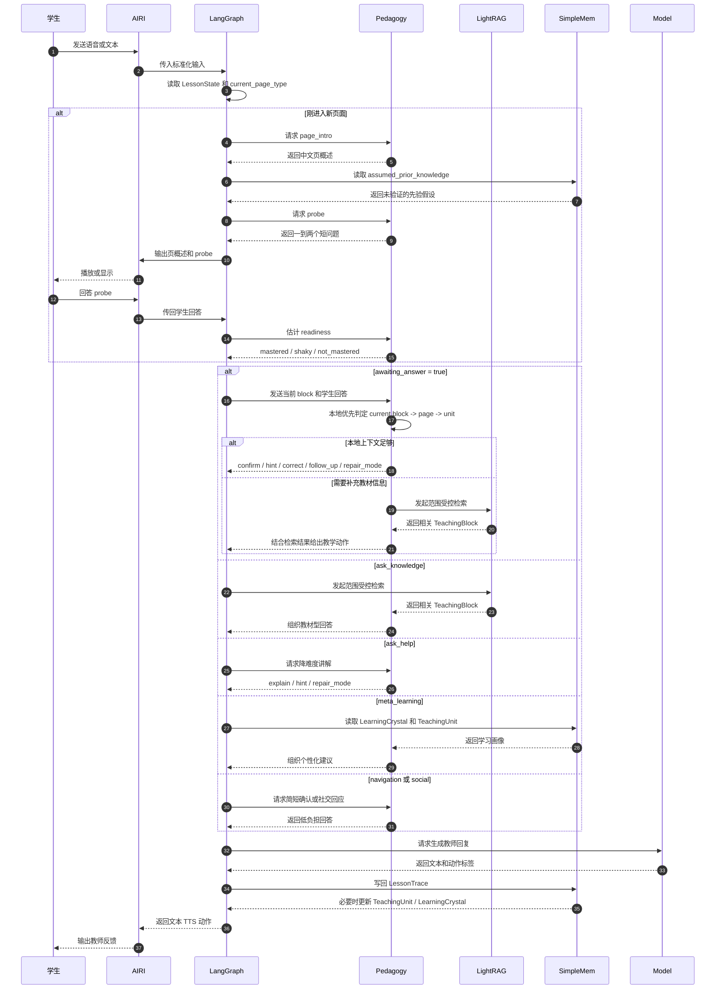

# User Input Diagrams

下面两张图描述同一件事：学生进入某一页后，系统如何按 `page_type` 推进教学，先做轻量诊断，再决定讲快、讲轻还是完整讲解。

## 用户输入流程图
```mermaid
flowchart TB
    start([学生输入<br/>例如 学习五上第31页]) --> airi["AIRI 接收输入<br/>语音或文本"]
    airi --> state["LangGraph 读取 LessonState"]
    state --> page_check{"是否刚进入新页面"}

    page_check -->|是| page_type["读取 current_page_type<br/>dialogue / vocabulary / listening 等"]
    page_check -->|否| wait_check{"是否正在等待学生回答"}

    page_type --> intro["page_intro<br/>先用中文说本页大纲"]
    intro --> prior["读取 assumed_prior_knowledge<br/>作为先验假设"]
    prior --> probe["probe<br/>问一到两个短问题"]
    probe --> readiness{"掌握状态估计"}

    readiness -->|mastered| fast_path["快路径<br/>快速进入迁移练习或 follow_up"]
    readiness -->|shaky| light_path["轻路径<br/>短讲解 + hint + 轻纠错"]
    readiness -->|not_mastered| full_path["完整路径<br/>explain + 示范 + 练习 + correct"]

    fast_path --> wait_check
    light_path --> wait_check
    full_path --> wait_check

    wait_check -->|是| local_eval["本地优先判定<br/>current block -> page -> unit"]
    wait_check -->|否| route["Turn Router<br/>answer_question / ask_knowledge / ask_help / navigation / social / meta_learning"]

    local_eval --> eval_result{"判定结果"}
    eval_result -->|correct 或 acceptable| confirm["confirm 或 follow_up"]
    eval_result -->|partially_correct| hint["hint"]
    eval_result -->|incorrect 或 off_topic| correct["correct 或 review_prerequisite"]
    eval_result -->|unclear| repair["repair_mode<br/>word_drill / sentence_drill / slow_read / asr_clarify"]

    route -->|ask_knowledge| retrieve["范围受控检索<br/>block -> page -> unit -> global"]
    route -->|ask_help| help["降难度讲解<br/>explain 或 hint"]
    route -->|navigation| nav["更新 LessonState<br/>确认切换"]
    route -->|social| social["简短社交回应<br/>不触发教材检索"]
    route -->|meta_learning| memory["读取 SimpleMem<br/>总结强项 弱项 下一步"]

    retrieve --> planner["Pedagogy Planner 组织回答"]
    help --> planner
    nav --> planner
    social --> planner
    memory --> planner
    confirm --> planner
    hint --> planner
    correct --> planner
    repair --> planner

    planner --> model["模型层生成教师回复"]
    model --> writeback["写回 LessonTrace<br/>必要时更新 TeachingUnit / LearningCrystal"]
    writeback --> airi_out["AIRI 输出文本 / TTS / 动作"]
    airi_out --> end([学生看到教师反馈])

    classDef input fill:#e7f5ff,stroke:#1971c2,color:#0b2239
    classDef state fill:#e6fcf5,stroke:#099268,color:#083d2b
    classDef pedagogy fill:#fff4e6,stroke:#e67700,color:#5f3b00
    classDef memory fill:#f3d9fa,stroke:#9c36b5,color:#4a154b
    classDef model fill:#fff3bf,stroke:#f08c00,color:#5c3d00

    class start,end input
    class airi,state,page_check,page_type,wait_check,route,local_eval,eval_result,nav,social state
    class intro,probe,fast_path,light_path,full_path,confirm,hint,correct,repair,help,planner pedagogy
    class prior,memory,writeback memory
    class retrieve,model,airi_out model
```

## 用户输入时序图


## 说明
- 教学主入口不是自由聊天，而是 `page_type`
- 新页面先做 `page_intro + probe`，再决定教学深度
- `assumed_prior_knowledge` 只是假设，必须先验证
- 学生进入 `shaky` 状态时，优先轻讲解和轻量修复，不直接全讲或直接跳过
